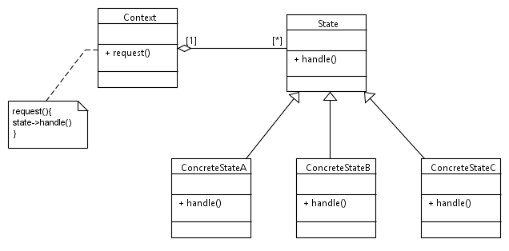

----------------------------------------------------------------------------------------------------------------
#The Adapter Pattern

###Sources:
Notes below regarding State pattern taken from "Design Patterns - Elements of Reusable Object-Oriented Software"
By Gamma, Helm, Johnson, Vlissides

Example Code provided by Derek Banas:
Tutorial: https://www.youtube.com/watch?v=MGEx35FjBuo&t=46s
Source Code: http://goo.gl/OEWg4

###Author: Justin J

###Purpose: FAU Object Oriented Software Design Course, Sprint 2017

----------------------------------------------------------------------------------------------------------------

##Intent
- allow an object to alter its behavior when its internal state changes
- object will appear to have changed its class

##Motivation
- allows an object to change its behavior at runtime

##Applicability
- when an object's behavior depends on its state and it must change its behavior at run-time
- when operations have large, multi-part conditional statements that depend on the object's state

##Structure
 

##Participants
####Context
- defines interface of interest to clients
- maintains an instance of ConcreteState subclass that defines the current state
####State
- defines an interface for encapsulating the behavior associated with a particular state of the Context
####ConcreteState Subclasses
- each subclass implements a behavior associated with a state of the Context

##Collaborations
- Context delegates state-specific requests to the current ConcreteState object
- Context may pass itself as an argument to the State object handling the request
- Context is the primary interface for clients. Clients can configure a context with State objects
	- clients don't have to deal with State objects directly
- Either Context or the ConreteState subclasses can decide which state succeeds another and under what circumstances

##Consequences
- localizes state-specific behavior and partitions behavior for different states
	- new states and transitions can be added easily by defining new state subclasses
	- does increase total number of classes, but reduces large conditional statements
- makes state transitions explicit
	- protects Context from inconsistent internal states
- state objects can be shared as long as they don't have instance variables
	- when shared in this manner, they are essentially flyweights with no intrinsic state, only behavior

##Implementation
- who defines the transitions?
	- may be implemented in Context if criteria is fixed
	- generally more flexible to let State subclasses specify their successor state and when to transition
		- requires adding interface to Context that lets State objects set Context's current state
	- disadvantage of decentralizing transition logic is that one State subclass will have knowledge of at least one other
		- introducing implementation dependencies between subclasses
- a table-based alternative
	- tables map inputs to state transitions
		- for each state, table maps every possible input to a succeeding state, converting traditional code to table look up
		- table look up is usually less efficient than virtual function call
		- makes transition criteria less explicit and harder to understand
	- state pattern models state specific behavior, whereas table-driven approach focuses on defining state transitions
- creating and destroying state objects
	- create State objects only when they are needed and destroy them after, or create them ahead of time and never destroy them?
	- 1st choice is preferred when states aren't known at runtime and Context changes state infrequently
	- 2nd choice is preferred when state changes rapidly, don't want to keep destroying/recreating states
		- instantiation costs are paid once up front, and there no destruction costs
- using dynamic inheritance
	- changing behavior for request can be accomplished by changing object's class at run time, but this is not possible in most OO languages

##Related Patterns
- flyweight
- state objects are often singletons
